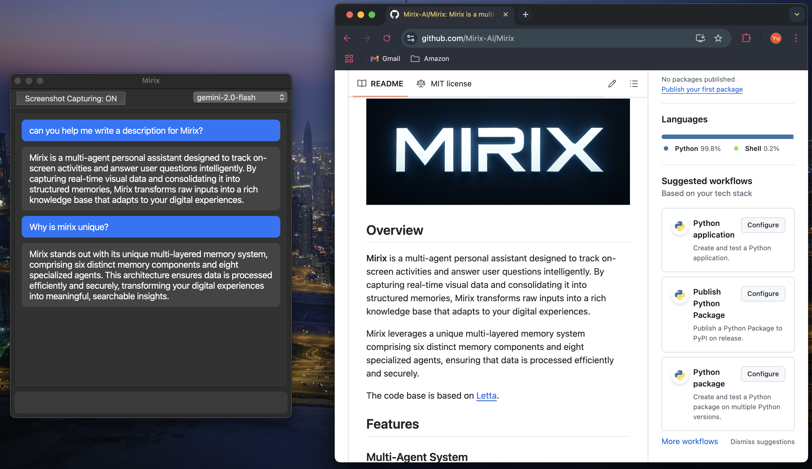

## Overview

**Mirix** is a multi-agent personal assistant designed to track on-screen activities and answer user questions intelligently. By capturing real-time visual data and consolidating it into structured memories, Mirix transforms raw inputs into a rich knowledge base that adapts to your digital experiences.

Mirix leverages a unique multi-layered memory system comprising six distinct memory components and eight specialized agents, ensuring that data is processed efficiently and securely.

<!--  -->

## Features

### Multi-Agent System

Mirix consists of eight specialized agents that work collaboratively:

- **Meta Agent:** Coordinates and updates various memory agents.
- **Chat Agent:** Engages in natural language conversations with the user.
- **Memory Managers:** Six agents each dedicated to managing one of the memory components:

#### Memory Components

**Core Memory**  
Inspired by MemGPT, Core Memory contains persistent information that should always be visible to the agent when interacting with the user. This includes two main blocks: `persona` (the agent's personality) and `human` (saved understanding of the user). Examples include "User's name is David", "User likes apples", and other essential personal preferences that remain consistent across conversations.

*Structure:* Organized in multiple blocks with line indicators (Line 1:, Line 2:, etc.). When blocks exceed 90% capacity, they are automatically rewritten to maintain optimal size.

**Episodic Memory**  
Captures context-specific events and temporal activities, serving as a summarization or calendar of the user's behaviors. This memory component focuses on what the user has done and is currently doing, providing temporal context for understanding user patterns and recent activities.

*Structure:* Each episodic entry contains:
- `event_type`: Category of the event (e.g., user_message, inferred_results, system_notification)
- `summary`: Short textual summary of the event 
- `details`: Detailed description capturing as much context as possible
- `actor`: Who generated the event (user or assistant)
- `timestamp`: When the event occurred (e.g., "2025-03-05 10:15")

**Semantic Memory**  
Maintains general knowledge, concepts, and abstracted information that is independent of temporal context. This includes facts like "Harry Potter is written by J.K. Rowling" or "John is a good friend of the user who likes jogging" - information that represents general concepts or knowledge rather than specific user activities.

*Structure:* Each semantic entry includes:
- `name`: The name of the concept or object
- `summary`: Concise explanation or definition
- `details`: Extended description with context and deeper insights
- `source`: Reference to where this knowledge originates

**Procedural Memory**  
Records process workflows and step-by-step instructions for accomplishing specific tasks. This memory stores guides and procedures, such as "how to order food from Uber Eats" or other task-oriented information that doesn't fit into episodic or semantic categories but provides valuable how-to knowledge.

*Structure:* Each procedural entry contains:
- `entry_type`: Type of procedure ('workflow', 'guide', 'script')
- `description`: Short descriptive text explaining the procedure
- `steps`: The detailed procedure in structured or JSON format

**Resource Memory**  
Manages active documents and project-related files that the user interacts with. When users are reading documents or files (like plans shared by friends for an upcoming picnic), this entire content is stored here as it doesn't easily categorize into other memory types, serving as a comprehensive knowledge base for documents and files.

*Structure:* Each resource entry includes:
- `title`: Short name/title of the resource
- `summary`: Brief description including project context and content overview
- `resource_type`: File type or format ('doc', 'markdown', 'pdf_text', 'image', 'voice_transcript')
- `content`: Full or partial text content of the resource (as detailed as possible)

**Knowledge Vault**  
Securely stores structured personal data such as addresses, phone numbers, contacts, and credentials. This information, while important, doesn't play a central role in everyday conversations and thus is kept separate from Core Memory. Sensitive items like passwords are tagged with `sensitivity=high` to prevent misuse.

*Structure:* Each vault entry contains:
- `entry_type`: Type of data ('credential', 'bookmark', 'api_key', 'contact_info')
- `source`: Origin of the information ('github', 'google', 'user_provided')
- `sensitivity`: Security level ('low', 'medium', 'high')
- `secret_value`: The actual data stored securely

#### Multi-Agent Workflow

The multi-agent system operates through a coordinated workflow that efficiently processes user inputs and manages memory across all components:

**1. Input Processing Pipeline**
```
User Input → Meta Agent → Memory Managers → Updated Memory Base
```

When user input (text, images, voice recordings, or other multimedia content) is received:
- The **Meta Agent** serves as the central coordinator, analyzing the incoming content
- It determines which memory components need updates based on the content type and context
- The Meta Agent then routes specific instructions to the relevant **Memory Managers**
- Each Memory Manager processes their assigned information and updates their respective memory component

**2. Memory Consolidation Process**
- Memory Managers work independently but share the same memory base
- Each agent follows a **single function call** process to make comprehensive updates
- The system accumulates information until reaching a threshold, then triggers batch processing
- Agents can skip updates if no relevant information is detected, ensuring efficiency

**3. Conversational Retrieval System**
```
User Query → Chat Agent → search_memory() → Memory Base → Response Generation
```

During conversations with users:
- The **Chat Agent** handles natural language interactions
- When responding to user queries, it calls the `search_memory()` function to retrieve relevant information
- This function searches across all six memory components simultaneously:
  - Core Memory for user preferences and essential facts
  - Episodic Memory for recent activities and events
  - Semantic Memory for general knowledge and concepts
  - Procedural Memory for step-by-step instructions
  - Resource Memory for documents and files
  - Knowledge Vault for structured data and credentials
- The Chat Agent synthesizes the retrieved information to generate contextually appropriate responses

**4. Intelligent Routing Logic**
The Meta Agent uses sophisticated logic to determine information distribution:
- **User preferences and personality traits** → Core Memory Manager
- **Activities and temporal events** → Episodic Memory Manager  
- **General knowledge and concepts** → Semantic Memory Manager
- **Step-by-step processes and guides** → Procedural Memory Manager
- **Documents and file contents** → Resource Memory Manager
- **Structured data and credentials** → Knowledge Vault Manager

This architecture ensures that information is processed efficiently, stored appropriately, and retrieved accurately during user interactions, creating a seamless and intelligent personal assistant experience.

## Advanced Search Capabilities

Mirix provides multiple sophisticated search methods for retrieving information from its memory components, with **PostgreSQL-native full-text search** as the primary implementation for optimal performance and scalability.

### Search Methods Overview

Mirix supports four distinct search methods, each optimized for different use cases:

1. **`embedding`** - Vector similarity search using embeddings
2. **`string_match`** - Simple string containment search  
3. **`bm25`** - **RECOMMENDED** - PostgreSQL native full-text search with BM25-like scoring
4. **`fuzzy_match`** - Fuzzy string matching (legacy, kept for compatibility)

### PostgreSQL Native BM25 Implementation

**Architecture**: All memory managers (Episodic, Semantic, Procedural, Resource, Knowledge Vault) now use PostgreSQL's native `ts_rank_cd` function for BM25-like scoring directly in the database.

**Key Technical Features**:
- **GIN Index Utilization**: Leverages existing GIN indexes on tsvector expressions for lightning-fast searches
- **Advanced Query Logic**: Smart AND → OR fallback for optimal precision and recall
- **Field Weighting System**: Implements PostgreSQL's A, B, C, D priority weighting
- **Document Length Normalization**: Uses ts_rank_cd with normalization parameter 32

### Performance Optimizations

**Memory Efficiency**:
- **Zero In-Memory Loading**: Eliminates the need to load all documents into Python memory
- **Database-Level Processing**: All ranking and filtering done at the PostgreSQL level
- **Scalable Architecture**: Performance scales with your PostgreSQL setup

**Query Optimization**:
- **Smart Query Strategy**: Tries precise AND queries first, falls back to broader OR queries
- **Prefix Matching**: Supports partial word matching with `:*` operators
- **Field-Specific Search**: Can target specific fields or search across all fields with weighting

### Search Field Specifications

Each memory type supports field-specific searches:

**Episodic Memory**: `summary`, `details`, `actor`, `event_type`
**Semantic Memory**: `name`, `summary`, `details`, `source`  
**Procedural Memory**: `summary`, `steps`, `entry_type`
**Resource Memory**: `title`, `summary`, `content`, `resource_type`
**Knowledge Vault**: `caption`, `source`, `entry_type`, `secret_value`, `sensitivity`

### Example Usage

```python
# PostgreSQL BM25 search across all fields
results = memory_manager.list_items(
    agent_state=agent_state,
    query="machine learning algorithms",
    search_method="bm25",
    limit=50
)

# Field-specific search  
results = memory_manager.list_items(
    agent_state=agent_state,
    query="neural networks",
    search_field="summary", 
    search_method="bm25",
    limit=20
)
```

### Performance Benchmarks

PostgreSQL native search provides:
- **50-100x faster** than in-memory BM25 processing
- **Linear scaling** with dataset size when properly indexed
- **Sub-millisecond response times** for most queries on indexed data
- **Enterprise-grade reliability** with PostgreSQL's battle-tested full-text engine

This architecture ensures optimal search performance while maintaining the semantic richness and contextual accuracy that Mirix users expect.

## Get Started with the Desktop Mirix App


## Get Started with the Mirix Backend
First, initialize the agent:
```python
from mirix.agent import AgentWrapper
agent = AgentWrapper("./configs/mirix.yaml")
```
Then send some context for the agent to absorb into memory:
```python
agent.send_message(
  message="The moon now has a president.", # (some facts, or knowledge, or conversations here)
  image_uris=["/path/to/image_1", "/path/to_image_2", ...],
  voice_files=["base64_encoding_here", "base64_encoding_here"],
  force_absorb_content=True
)
```
If the message contains other images (i.e., a multi-modal conversation), then the code will be like:
```python
agent.send_message(
  message=[
    {'type': 'text', 'text': "The moon now has a president. This is how she looks like:"},
    {'type': 'image', 'image_url': "base64_encoding_here"}
  ], # (some **multi-modal** facts, or knowledge, or conversations here)
  image_uris=["/path/to/image_1", "/path/to_image_2", ...],
  voice_files=["base64_encoding_here", "base64_encoding_here"],
  force_absorb_content=True
)
```

In our application above, `message` would be the conversation history between you and the chat agent, `image_uris` would be the paths to the screenshots, `voice_files` are the base64 encodings from the voices recorded at the frontend. 
If `force_absorb_content` is set to False, then the agent will accumulate 20 images before running the absorption process.

The reason that we do not use base64 encoding for images is that they are too large. (Is this true? Need to verify this). 


### Intelligent Memory Consolidation

Mirix does not simply store raw data. Instead, it processes screen captures and contextual inputs to generate organized, searchable knowledge. This ensures that your digital experiences are converted into meaningful insights without overwhelming the system with unstructured information.

### Security & Privacy

- **Screenshot Handling:**  
  - Takes a screenshot every second and uploads the most recent 600 (roughly 10 minutes of data) to your personal Google Cloud storage.
  - Automatically deletes older screenshots to enhance privacy.
- **Local Data Storage:**  
  - Consolidated information is stored locally in a secure PostgreSQL database (recommended) or SQLite database.
  - PostgreSQL provides enhanced performance, concurrent access, and advanced vector search capabilities.
- **User-Controlled Privacy:**  
  - All long-term user data remains local, and only your own Google Cloud account is used for temporary storage of screenshots.
  - Designed with security practices akin to how modern browsers safely store sensitive data.

## Installation

### Prerequisites

- Python 3.11 or later
- A valid [GEMINI API key](https://your-api-key-provider.com)

### Setup

1. **Clone the Repository:**
    ```bash
    git clone https://github.com/Mirix-AI/Mirix.git
    cd Mirix
    ```

2. **Configure the Environment:**
    Create a file named `.env` in the project root and add your GEMINI API key:
    ```dotenv
    GEMINI_API_KEY=your_api_key_here
    ```

3. **Install Dependencies:**
    ```bash
    pip install -r requirements.txt
    ```

4. **Set up PostgreSQL Database (Recommended):**
    
    Mirix uses PostgreSQL for better performance, scalability, and vector search capabilities.
    
    **Install PostgreSQL and pgvector:**
    ```bash
    # On macOS using Homebrew
    brew install postgresql@17 pgvector
    
    # On Ubuntu/Debian
    sudo apt-get install postgresql postgresql-contrib
    # pgvector installation varies by system - see https://github.com/pgvector/pgvector
    
    # On Windows - Download from https://www.postgresql.org/download/windows/
    ```
    
    **Start PostgreSQL and enable pgvector:**
    ```bash
    # Start PostgreSQL service
    brew services start postgresql@17  # macOS
    # sudo systemctl start postgresql    # Linux
    
    # Then set the environmental variable
    export PATH="$(brew --prefix postgresql@17)/bin:$PATH"
    
    # Create the mirix database that the application will use
    createdb mirix

    # Enable pgvector extension (one-time setup)
    psql -U $(whoami) -d mirix -c "CREATE EXTENSION IF NOT EXISTS vector;"
    ```
    
    **Configure Environment Variables:**
    
    Add PostgreSQL configuration to your `.env` file:
    ```dotenv
    GEMINI_API_KEY=your_api_key_here
    
    # PostgreSQL Configuration (replace 'your_username' with your system username, you can find it by running `echo $(whoami)`)
    # MIRIX_PG_URI=postgresql+pg8000://your_username@localhost:5432/mirix
    ```
    
    > **Note**: This setup uses your system user (which has superuser privileges) for simplicity in development environments. For production use, consider creating a dedicated PostgreSQL user with limited privileges.
    
    **That's it!** Mirix will automatically create all necessary tables on first startup.

5. **Start Mirix:**
    ```bash
    python main.py
    ```

Mirix will automatically create all necessary database tables on first startup and begin processing on-screen activities immediately.

### Agent Backup and Restore

Mirix provides built-in backup and restore functionality for your agent data:

Since we need to use `pg_dump` to save the database, we need to make sure `pg_dump` is accessible by running:
```
export PATH="$(brew --prefix postgresql@17)/bin:$PATH"
```

**Creating Backups:**
```python
from mirix.agent import AgentWrapper
agent = AgentWrapper("./configs/mirix.yaml")

# Save current agent state to a folder
result = agent.save_agent("./my_backup")
print(result['message'])  # "Agent state saved successfully..."
```

**Restoring from Backups:**
```python
# Method 1: Restore during agent initialization (recommended)
agent = AgentWrapper("./configs/mirix.yaml", load_from="./my_backup")

# Method 2: Load backup after agent creation
agent = AgentWrapper("./configs/mirix.yaml")
result = agent.load_agent("./my_backup")
```

The backup system automatically handles both PostgreSQL and SQLite databases, preserving all your conversations, memories, and agent configurations.

### Troubleshooting Database Setup

**Common Issues:**

1. **"extension 'vector' is not available" error:**
   ```bash
   # Install pgvector first
   brew install pgvector  # macOS
   # Then enable the extension
   psql -U $(whoami) -d postgres -c "CREATE EXTENSION IF NOT EXISTS vector;"
   ```

2. **"permission denied to create extension" error:**
   ```bash
   # pgvector extension requires superuser privileges
   # Try connecting as the postgres superuser
   psql -U postgres -d postgres -c "CREATE EXTENSION IF NOT EXISTS vector;"
   ```

3. **Connection refused or timeout:**
   ```bash
   # Make sure PostgreSQL service is running
   brew services start postgresql@17  # macOS
   sudo systemctl start postgresql    # Linux
   ```

4. **"database 'mirix' does not exist" error:**
   This means the mirix database hasn't been created yet. Create it manually:
   ```bash
   createdb mirix
   
   # If createdb is not in your PATH, use the full path:
   # /opt/homebrew/opt/postgresql@17/bin/createdb mirix  # macOS with Homebrew
   ```

5. **"pg_dump: No such file or directory" error during backup:**
   This error occurs when the environmental variable is not set correctly. Simply run:
   
   ```bash
   export PATH="$(brew --prefix postgresql@17)/bin:$PATH"
   ```
   
   This ensures that the `pg_dump` utility is accessible in your system PATH.

6. **Fallback to SQLite:**
   If PostgreSQL setup fails, Mirix will automatically fall back to SQLite. Simply omit the PostgreSQL environment variables and run:
   ```bash
   python main.py
   ```

## Evaluation Results

**Dataset 1 (1.5 hours, 700 images):**  
For evaluation, approximately 700 images were collected capturing one user's (the author's) activities between 0:00 and 1:30 AM on March 9th. Questions were then posed regarding these activities, resulting in the following performance outcomes:

| Model                  | Accuracy            |
|------------------------|---------------------|
| Gemini                 | 0.0833 (1/12)       |
| Letta                  | Not Applicable      |
| Letta-MultiModal       | Under Development   |
| Mem0                   | Not Applicable      |
| **Mirix-2025-04-08**   | **0.4167 (5/12)**   |
| **Mirix-2025-04-20**   | **0.5000 (6/12)**   |

**Dataset 2 (24 hours, 5886 images):**
| Model | Accuracy $\uparrow$ | Storage Size (MB) $\downarrow$ |
|-------|---------|---------|
| Gemini | 0.00 (0/16) | 23091.67 |
| **Mirix-2025-04-27** | 0.5000 (8/16) | **20.57** |


## License

Mirix is released under the MIT License. See the [LICENSE](LICENSE) file for more details.

## Contact

For questions, suggestions, or issues, please open an issue on the GitHub repository or contact us at `yuw164@ucsd.edu`

## Acknowledgement
We would like to thank [Letta](https://github.com/letta-ai/letta)  for open-sourcing their framework, which served as the foundation for the memory system in this project.
